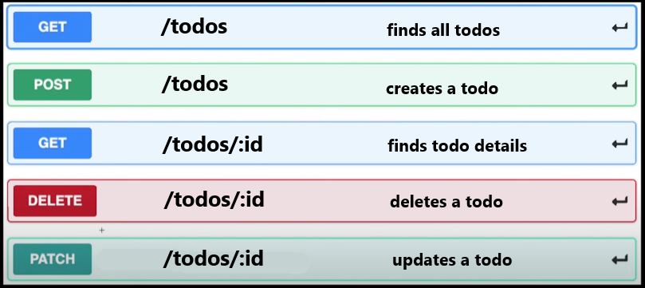
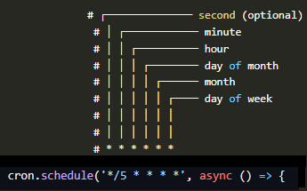

# Simple To-Do API
This is a simple RESTful API for managing a to-do list. It allows you to create, read, update, and delete tasks. Additionally, it features a scheduled task using `node-cron` to automatically remove completed tasks from the list after 5 minutes.

## Getting Started

Follow these steps to get started with the Simple To-Do API:

### Prerequisites

Before you begin, ensure you have the following installed on your system:

- [Node.js](https://nodejs.org/) (with npm)
- [Postman](https://www.postman.com/downloads/) (for API testing)

### Installation

1. Clone the repository to your local machine:

   ```bash
   git clone https://github.com/your-username/simple_todo_api.git

2. Navigate to the project directory:

   ```bash
   cd simple-todo-api
3. Install the project dependencies:

   ```bash
   npm install
   
### Starting the Server
1. Start the server by running the following command:
   ```bash
   npm start
  The Server will run on `http://localhost:5000`.
### Using the API
You can use a tool like Postman to interact with the API. Here are some example requests:
**Create a New Task:**
Send a POST request to `http://localhost:5000/todos` with a JSON body like this:
```json
{
    "title": "Finish report",
    "description": "Complete the project report.",
    "completed": true
  }
```
Retrieve the List of Tasks:
Send a GET request to `http://localhost:5000/todos`

Update a Task:
Send a PATCH request to `http://localhost:5000/todos/:id` with a JSON body to update the task details.

Delete a Task:
Send a DELETE request to `http://localhost:5000/todos/:id`

Scheduled Task (Cron Job)
A scheduled task is set to run every 5 minutes.
It removes tasks from the list where `"completed"` is set to `true` in the `todos.json` file.
This is done to keep the list tidy by automatically removing completed tasks.



